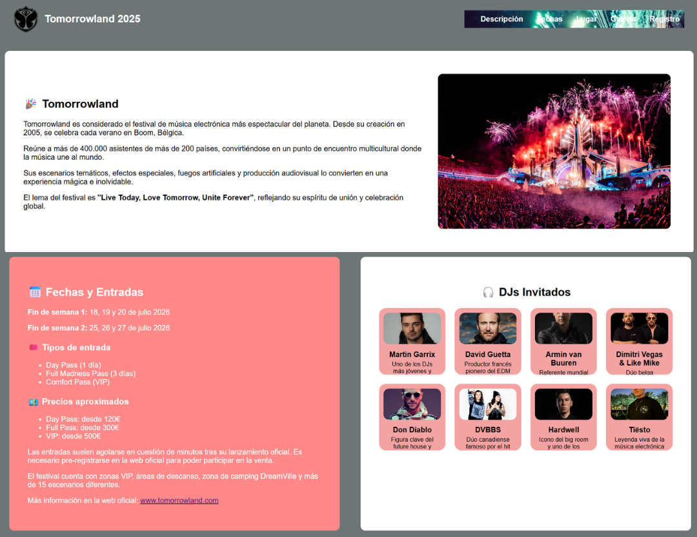
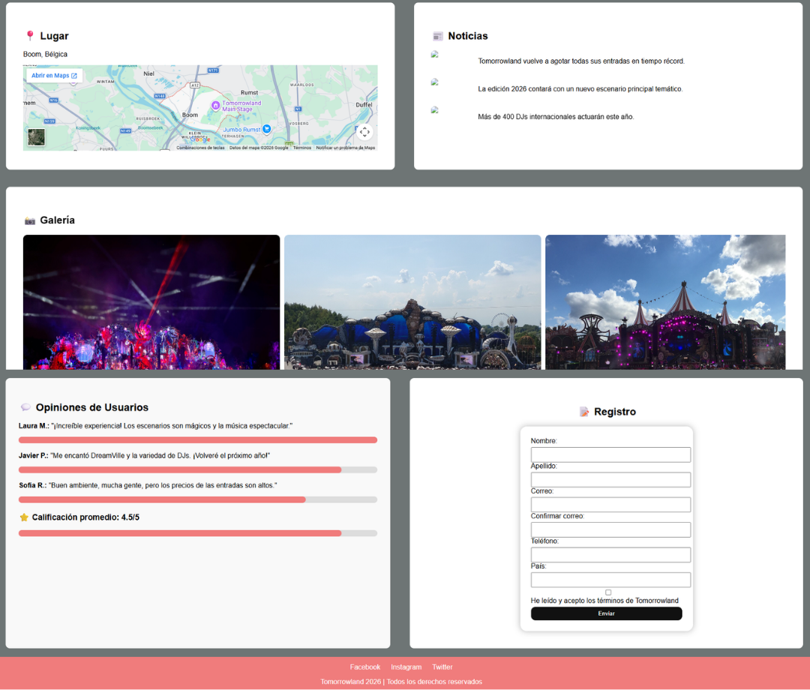
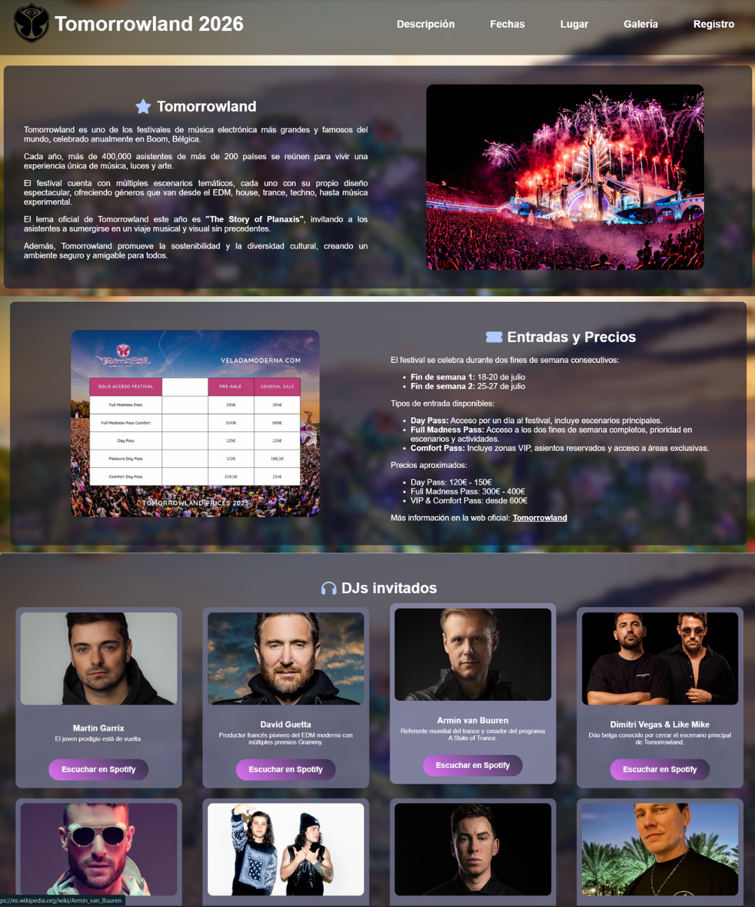
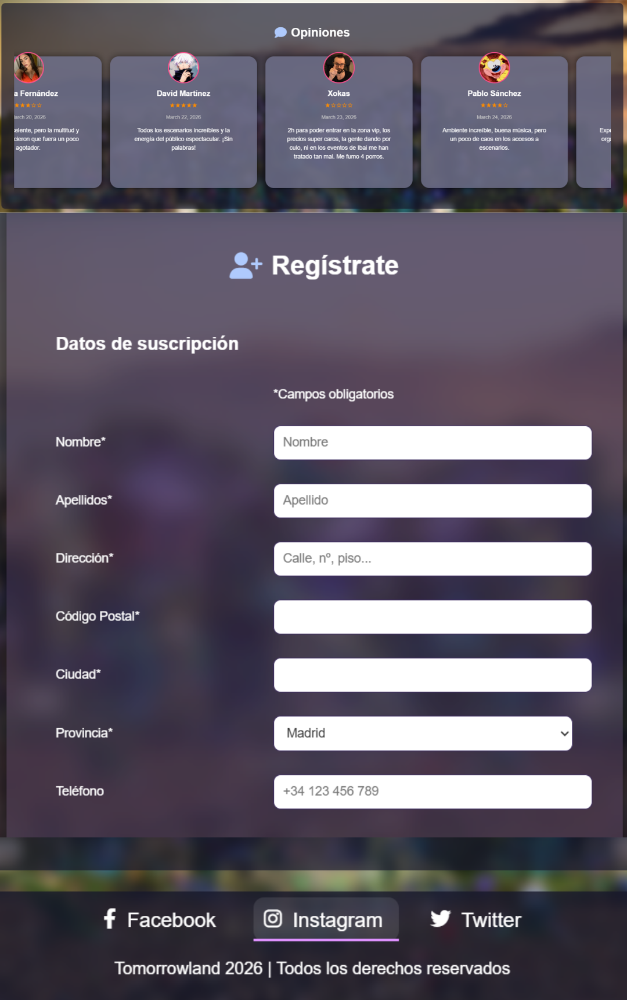

A year ago, we completed a class project that involved designing a website about a festival of our choice. Due to my limited time because of my previous job and my lack of dedication at the time, my project did not stand out in terms of design and lacked important functionality. Nevertheless, the instructor granted me a passing grade.

However, I felt frustrated for not being able to deliver a project on par with my classmates. Today, a year later, I can be proud of this work, to which I have dedicated significant time to ensure it looks polished and reflects how it should have been originally submitted. I have focused not only on creating an attractive design but also on incorporating meaningful functionality to enhance the user experience.

This project represents an important step in my development as a professional and demonstrates that with dedication, it is possible to achieve outstanding results.

Here’s the link so you can take a look:

https://h4ll3ydev.github.io/Tomorrowland/
